# Inspirational Homepage

Able to view the live site here [https://inspirationalhomepagekw.netlify.app/](https://inspirationalhomepagekw.netlify.app/)

An inspirational homepage that interacts with different APIs to display the current weather, a background image, and an inspirational quote. It will also provide users with a space to write down their goals for the day.

## Table of Contents
1. [Installation](#installation)
2. [Features](#features)
3. [Technologies Used](#technologies-used)
4. [History](#history)
    1. 08/02/2021 - [Mockups](#mockups)
    2. 08/11/2021 - [Goals](#goals)
    3. 08/12/2021 - [Quotes](#quotes)
    4. 08/21/2021 - [Weather](#weather)
    5. 08/21/2021 - [Settings](#settings)
    6. 08/23/2021 - [Background](#background)
5. [Future Work](#future-work)

## Installation

TODO: Write installation process

## Features

- Users can check the current weather
- Users are shown an inspirational image
- Users can cycle through multiple fetched images
- Users are shown an inspirational quote
- Users can write down their own goals
- Users can delete goals
- Users can mark goals as complete

## Technologies Used

- HTML
- CSS
- JavaScript
- React
- Redux
- Git and GitHub
- Deployment with Netlify

## History

### Mockups 
August 02, 2021\
(Created using [Figma](https://www.figma.com/))

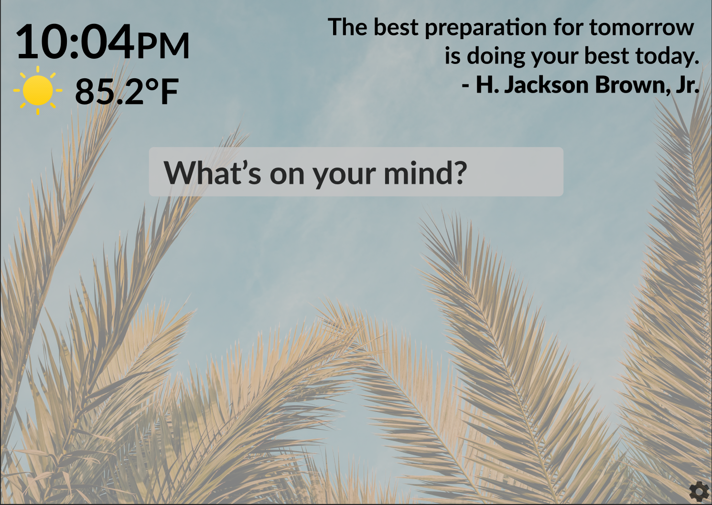
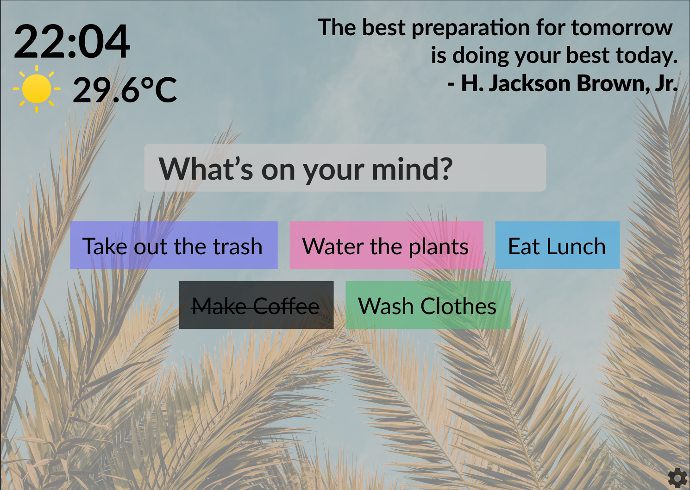
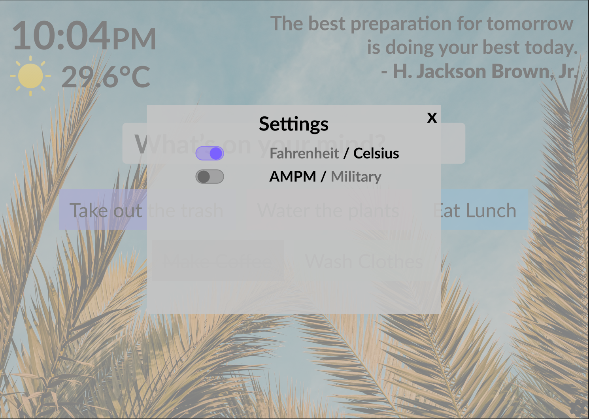

### Goals
August 11, 2021

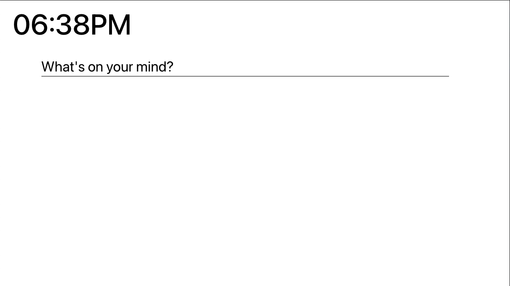
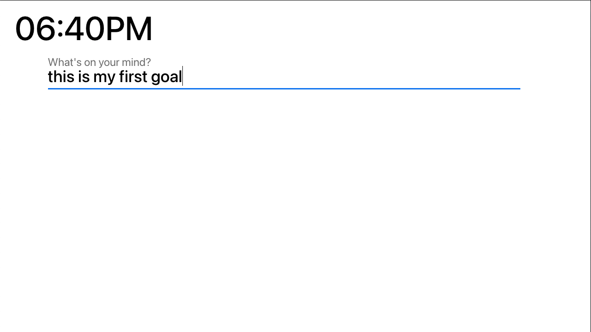
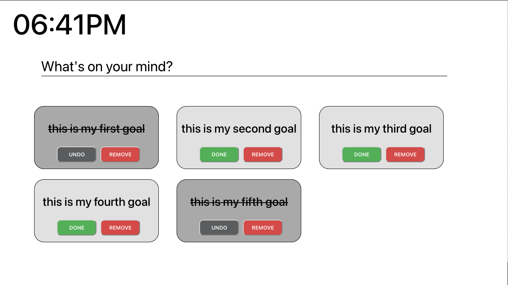

### Quotes
August 12, 2021

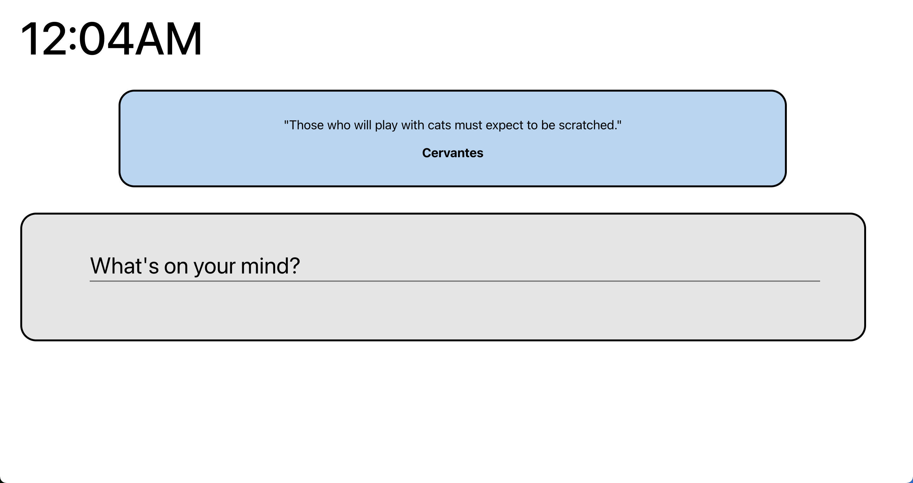

### Weather
August 21, 2021

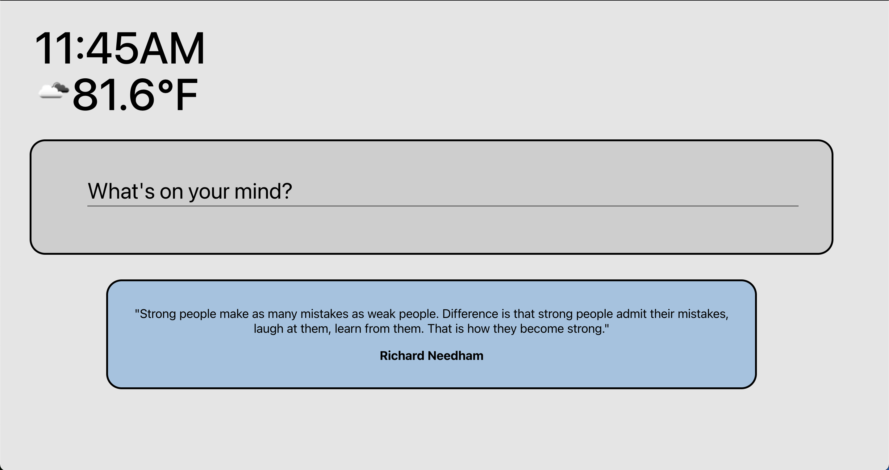

### Settings
August 21, 2021

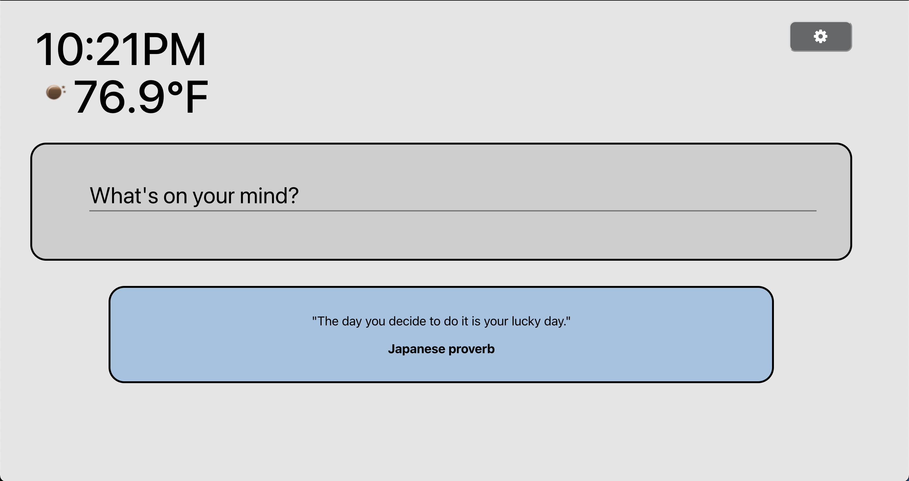
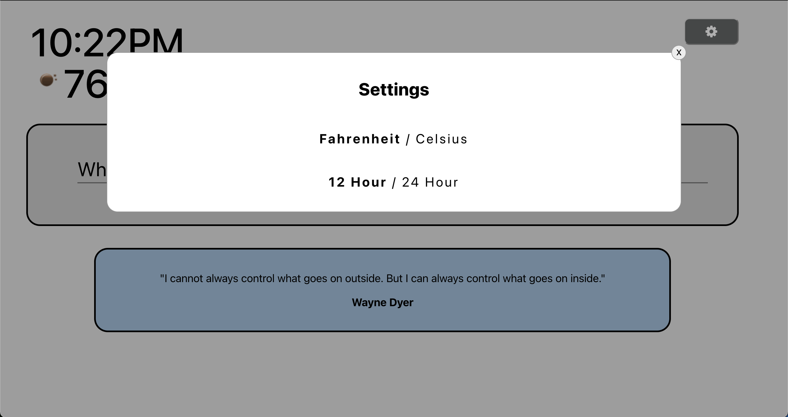

### Background
August 23, 2021

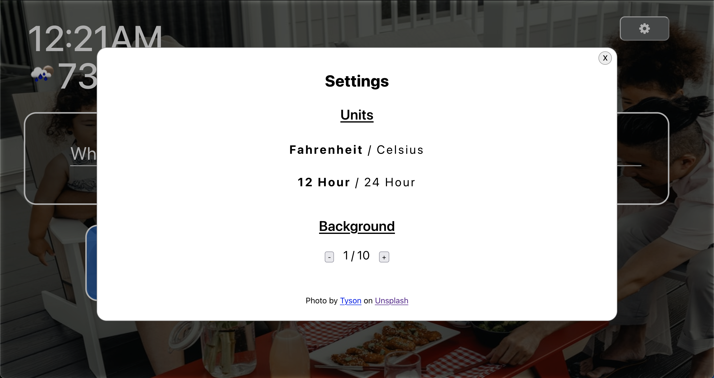

## Future Work

These are the features that are planned to be implemented after the main features are finished.

- Date to be displayed above time
- Saving goal data locally so that when page refreshes, past goals are displayed
- Add edit feature to goal
